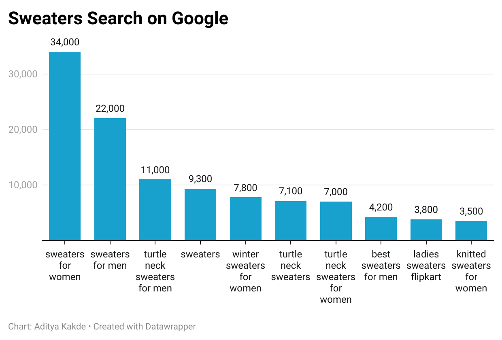
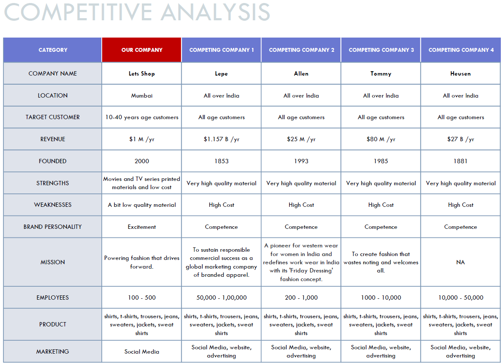

# CLOTHING STORE MARKET RESEARCH

This project is based on market research analytics that was carried out on the clothes retailer - Lets Shop. For the benefit of the project, this clothes store is fictitious and only exists to showcase the work. This gym is a tiny company located in Mumbai, Maharashtra, India, with a customer base that is mostly composed of people between the ages of 10 to 40 years.

On the basis of the interest in clothes and fashion brands among individuals all throughout India, a thorough analysis has been given about how the interest has evolved.

Technical market research models such as Buyers Persona, Porter's Five Forces Analysis, SWOT Analysis, and Competitive Analysis have been applied.

Surveys and Focus Groups were not conducted due to data insufficiency because as said earlier – made up clothing store.

## Table of Contents

| S.No             | Title      |
| -----------------| -------------- |
| 1. | Exploratory Data Analysis |
| 2. | Buyers Persona |
| 3. | Competitive Analysis |
| 4. | SWOT Analysis |
| 5. | Porter’s Five Force Analysis |

## 1. Exploratory Data Analysis

In-depth graphical analysis using bar graphs and pie charts.

### 1.1. Clothes Shopping Trend

This section shows the clothing trend in India from past 12 months.

### 1.2. Clothes Brand Trend

This section shows 4 clothing brands currently in the trending position from past 12 months in India.

### 1.3. E-commerce 

This section shows the trend of most famous e-commerce websites in India from past 12 months.

### 1.4. Shirts, T-Shirts, Jeans, Trousers, Jackets and Sweaters Trend

This section shows different types of clothes trends in India from past 12 months.

### 1.5. Questions Searches of different types of clothes

This section shows the questions that are asked in Google regarding different types of clothes.

## 2. Buyers Persona

Buyers Persona helps to know the customers for marketing purposes and providing better customer services.

## 2. Competitive Analysis

The competitive analysis helps to know who we are competing with, their tactics and our level when compared to others which eventually results more learning and growth.

## 3. SWOT Analysis

Swot analysis helps to identify the current position of the company and what changes can be made to improvise.

## 4. Porter's Five Force Analysis

